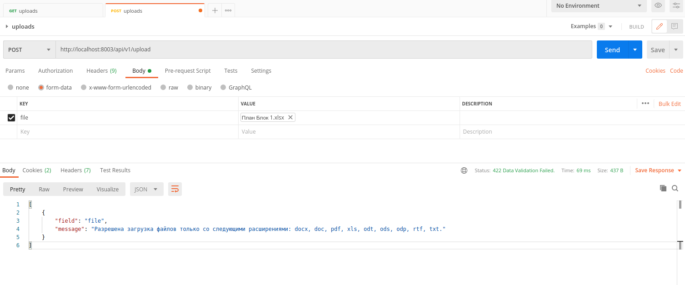
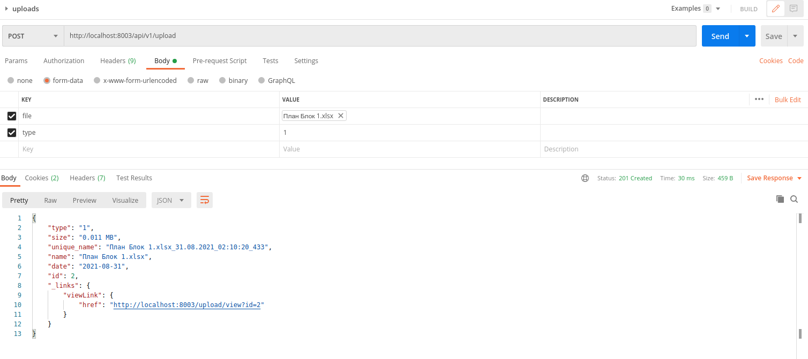

# Ревью от 30.08.2021

1. Папки окружения IDE

Скорее всего по ошибке попало в резиторий, но не стоит добавлять папки типа .vscode. Чтобы потом у других разработчиков конфликтов не было.

2. Увидела по коммитам, что была проблема с подключением иконок от картика. Надо было просто сделать вместо:

```php
    'params' => [
        'icon-framework' => \kartik\icons\Icon::FAS,
        $params
    ],
```

так:

```php

    'params' => array_merge([
        'icon-framework' => \kartik\icons\Icon::FAS,
    ], $params),

```

3. Уникальное имя файла

```php
    $unique_name = $upload->name . '_' . date('d.m.Y_h:i:s') . '_' . rand(1, 1000);
```

Довольно интересное решение) Для тестовой задачи этой энтропии хватит, но вообще я имела в виду
что-то типа [uniqid (с more_entropy)](https://www.php.net/manual/ru/function.uniqid.php).

Единственное замечание - лучше определить где-то в классе Upload метод для генерации уникального имени и оттуда его вызывать, вместо того, чтобы в нескольких местах дублировать код.

4. Проверка на существование файла

Почему-то упускала этот момент. Тут же всё-таки должна быть проверка на наличие файла, а не на его отсуствие,верно?))

```php
    if (!file_exists(Upload::getPathToFile($model->unique_name))) {
        unlink(Upload::getPathToFile($model->unique_name));
    }
```

5. Лишний код или проверки

Случай 1. Тут не нужен isset. Функция findOne возвращает модель или 
null при её отсутствии.

```php
    $modelClass = $this->modelClass;
    if (($model = $modelClass::findOne($id)) !== null) {
        if (isset($model)) {
            return $model;
        }
    }
```

Случай 2. Здесь не нужен новый экземпляр класса Pagination и Upload.
Мы специально вызываем `$dataProvider->prepare()`, чтобы заставить
Yii подготовить данные для вывода. Дальше нам остается только 
использовать `$dataProvider->pagination` в нужном месте.

```php
    $searchModel = new UploadSearch();
    $dataProvider = $searchModel->search(Yii::$app->request->queryParams);
    $dataProvider->pagination->pageSize = 24;
    $query = Upload::find();
    $pages = new Pagination(['totalCount' => $query->count()]);
    $dataProvider->prepare();
    return $this->render('index', [
        'searchModel' => $searchModel,
        'dataProvider' => $dataProvider,
        'pagination' => $pages,
    ]);
```

6. Некорректное использование метода HTTP (или я плохо поняла код и есть js обработчик?)

Увидела такую конструкцию:

```php
echo Html::a(FAS::i('trash-alt'), ['delete', 'id' => $model->id], ['data' => ['method' => 'post'], 'data-confirm' => Yii::t('backend', 'Точно удалить файл?')]);
```

Меня смутила часть `'data' => ['method' => 'post'],`. Если это data для последующей отправки запроса через ajax, то я это ещё понимаю.

А вот если нет, то это неправильное использование HTTP метода в HTML, потому что тип метода можно установить только на элементе `<form>`.

Вообще тут правило как и с REST API. GET - это что-то получить (фильтрация, поиск, выборка, детальная информация), а POST - отправить (изменить, создать, удалить). И по хорошему во втором случае должна быть проверка на сервере, что если запрос, не POST, то выкинуть исключение MethodNotAllowed. 

Почему необходимо критичные проверки дублировать на сервере? Потому что клиенту доверять нельзя. Данные можно подменить банально изменив html-код на
страничке через инструменты хрома/огнелиса. Через консоль можно изменить поведение JS скриптов. 

Хорошо известный пример - сайт Госуслуг. Там есть форма для получения загранника. И вот когда-то (пару лет назад) там было обязательное поле "Отчество" и строгий формат каких-то ещё данных,  но валидация была только на клиенте. Программист, которому был нужен документ, просто руками скорректировал код на странице и отправил форму))

7. API

DELETE. Чуть поправила, чтобы вот прямо совсем REST было) 

CREATE. Что-то поправил, что-то нет. Поправлю код для примера, как это должно выглядеть.

Я в предыдущем ревью "наревьюила" с выводом ошибок)) Позже уже, закопавшись в код, нашла, что Yii достаточно умный, чтобы самому выдать ошибки.



А вот так выглядит отбивка, когда всё ОК.




UPDATE. **Задание!** Переписать метод UPDATE по аналогии с методом CREATE. 
Опираться можно на стандартный метод Yii (vendor/yiisoft/yii2/rest/UpdateAction.php).

**Дополнительно:** сделать API для модели user. В выгрузку не включать хэши паролей и прочие чувствительные данные. 

**Дополнительно 2 (если я опять буду долго проверять):** посмотреть, как реализовывается защита APIна Yii2 и попробовать реализовать в коде. Нужно это затем, чтобы не каждый встречный мог вытаскивать "внутренности" системы.


<p align="center">
    <a href="https://github.com/yiisoft" target="_blank">
        
    </a>
    <h1 align="center">Приложение для хранения документов на PHP (https://projectsil.ru)</h1>
    <h3 align="center">Необходимо разработать приложение, которое позволит организовывать хранение документов с различными разрешениями.</h3>
</p>


Требования к функционалу:
-------------------

○ Документы должны делиться на публичные (доступны «гостям»), условно-приватные (доступны авторизированным пользователям) и приватные (доступны только загрузившему пользователю).
</br>
○ Необходимо предусмотреть функционал авторизации и регистрации.
</br>
○ Необходимо вести некоторую статистику:
</br>
   − Сколько документов загружено в день / месяц / год
</br>
   − Соотношение публичных, условно-приватных и приватных документов за выбранный интервал времени.
</br>
○ Бекэнд должен быть написан на Yii2

Роли в системе:
-------------------

○ Гость – неавторизованный посетитель системы. Может просматривать публичные документы.
</br>
○ Необходимо предусмотреть функционал авторизации и регистрации.
</br>
○ Пользователь – посетитель, имеющий учетную запись в системе и авторизованный в ней. Может загружать свои документы, настраивать их приватность; просматривать публичные, условно-приватные и свои документы.
</br>
○ Администратор – пользователь, имеющий права на просмотр всех файлов и на управление другими пользователями.
INSTALLATION

Дополнительно (по желанию):
-------------------
○ Написание простых unit или acceptance тестов.
